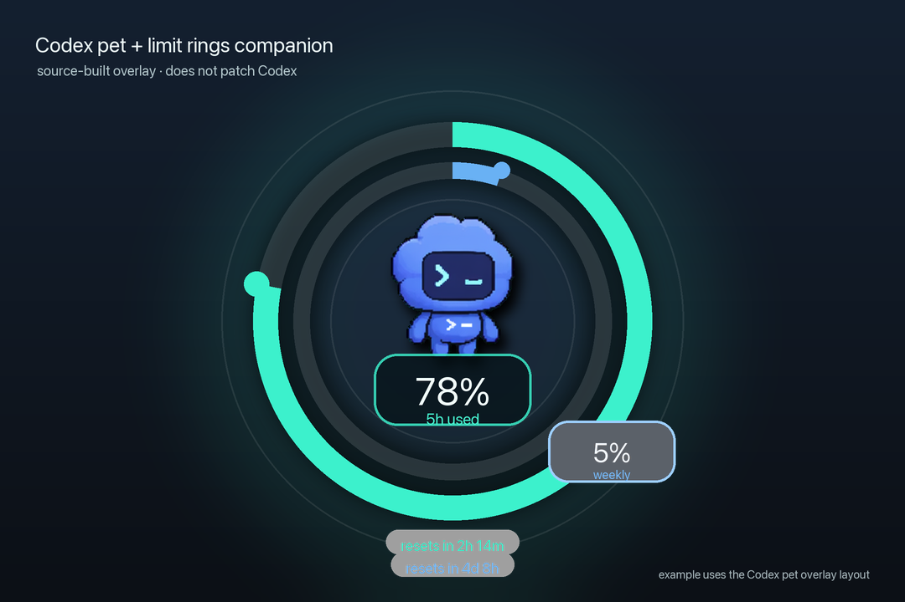

# codex-pet-limit-rings

Codex pets are tiny ambient companions for the work happening in Codex. This project adds one more layer to that idea: your pet can quietly show how much Codex capacity you have left, without turning the app into a dashboard.

The experience is a small macOS companion app. It watches where the Codex pet is, draws two polished rings around it, and keeps those rings attached to the pet as it moves. It does not patch Codex, change pet art, or modify the Codex app bundle.

It works with whatever Codex pet you like. Built-in pet, custom pet, tiny dog, robot, weather daemon, or anything else: the app does not care. It only follows the pet window that Codex is already showing.



## Latest Installer

Download the latest macOS installer package:

- [CodexPetLimitRings-0.4.0.pkg](https://github.com/jung-wan-kim/codex-pet-limit-rings/releases/download/v0.4.0/CodexPetLimitRings-0.4.0.pkg)

The `.pkg` installs `CodexPetLimitRings.app` into `/Applications`, writes the per-user LaunchAgent, and starts the menu-bar companion.

> **macOS Gatekeeper note:** the public package is currently unsigned because this repo does not have a Developer ID Installer certificate. If macOS says Apple cannot verify the package, install only if you trust this repo: either right-click/control-click the package and choose **Open**, approve it in **System Settings → Privacy & Security → Open Anyway**, or run `sudo installer -pkg ~/Downloads/CodexPetLimitRings-0.4.0.pkg -target /`. Future signed builds can be produced by setting `CODEX_PET_LIMIT_RINGS_PKG_SIGN_IDENTITY` and `CODEX_PET_LIMIT_RINGS_NOTARY_PROFILE`.

## What’s New in 0.4.0

- Added a branded macOS app icon and embedded it in the app bundle.
- Added a standalone `.pkg` installer that installs into `/Applications` and starts the companion app.
- Added optional DMG packaging with a Finder-style `Applications` alias for drag-install fallback.
- Improved the compact ring UI: 70% sizing, clockwise usage arcs from 12 o’clock, center usage/remaining toggle, and cleaner borderless visuals.
- Improved hover behavior: reset countdown stack, ring-matched colors, tighter spacing, and draggable hover area.
- Persisted dragged ring position so the overlay does not snap back after moving.

## What You See

The rings are designed to be glanceable:

- The outer ring fills by short-window usage percentage.
- The inner ring fills by weekly usage percentage.
- Both rings start at the 12 o'clock position and fill clockwise.
- The overlay is intentionally compact, rendering at 70% of the original companion-ring footprint.
- The center shows the short-window percentage in large text, with the weekly percentage below it in smaller text.
- Clicking the center toggles that display between usage and remaining-limit percentages.
- Decorative borders, inactive track outlines, tick marks, and extra dots are omitted to keep the compact overlay clean.
- Color moves from calm green/blue to amber and red as usage gets high.
- Hovering over the pet or rings shows two reset countdowns together below the center, with the 5h value above the weekly value and colors matching their rings.
- Hovering over the pet/rings changes the cursor to an open hand; dragging from that hover area locks the rings at the new position so they do not snap back to stale Codex coordinates.
- A small menu-bar icon lets you hide the rings, refresh data, reset the locked ring position, or quit.

When the Codex pet is closed, the rings disappear. When the pet comes back, they come back too. On multi-display setups, the rings stay with the pet instead of jumping to whichever screen is focused.

Because the rings are drawn in a separate transparent overlay, they do not need pet-specific sprites, masks, metadata, or configuration. Change pets in Codex and the rings follow the new one automatically.

## Why It Works This Way

The important design choice is the companion boundary. A menu item inside Codex itself would mean patching Electron app files and redoing that patch after app updates. That is brittle and hard to open source.

`codex-pet-limit-rings` stays outside the Codex app. It reads local Codex state, asks ChatGPT for live usage data using the local Codex/ChatGPT token, and renders its own transparent always-on-top window around the pet. The result is reversible, inspectable, and easy for another Codex agent to install or modify.

## Quick Start

Install the rings as a login item:

```bash
tools/install-limit-rings.sh
```

Build a shareable macOS installer package locally:

```bash
tools/build-limit-rings-pkg.sh
```

This writes `dist/CodexPetLimitRings-<version>.pkg`. Optional DMG packaging remains available via `tools/package-limit-rings-dmg.sh`, but the recommended distributable is the `.pkg` installer.

You should see a small rings icon in the macOS menu bar. Use that menu to toggle `Show Rings`, refresh the latest usage data, reset the locked position, or quit.

Then use any Codex pet normally. No pet setup step is required.

Run a development build without installing the login item:

```bash
tools/run-limit-rings.sh
```

Uninstall everything the installer adds:

```bash
tools/uninstall-limit-rings.sh
```

## Give This Repo To Codex

This repository is structured so a Codex agent can pick it up from a GitHub link.

Ask the agent:

```text
Use the bundled codex-pet-limit-rings skill from this repository. Install the rings companion for my Codex pet, verify the LaunchAgent is running, and confirm the rings stay anchored to the pet.
```

The agent should read:

- `AGENTS.md` for the project contract.
- `skills/codex-pet-limit-rings/SKILL.md` for the install, debug, and validation workflow.
- `docs/limit-rings.md` for the data and rendering model.

To install the bundled skill into local Codex:

```bash
tools/install-codex-skill.sh
```

## Data And Privacy

The app reads only local Codex files and one ChatGPT usage endpoint:

- `~/.codex/.codex-global-state.json` tells it whether the pet is open and where it is.
- `~/.codex/auth.json` provides the local bearer token used to read live usage from ChatGPT.
- `~/.codex/logs_2.sqlite` is used as a cached fallback if live usage is unavailable.

It does not require an OpenAI API key. It does not send pet images, screenshots, prompts, or repo contents anywhere.

## Project Shape

```text
tools/
  codex-pet-limit-rings.swift      native macOS companion app
  install-limit-rings.sh           build, install, and start at login
  uninstall-limit-rings.sh         remove the app and login item
  run-limit-rings.sh               development launch
  build-limit-rings.sh             app bundle builder with app icon
  build-limit-rings-pkg.sh         create dist/CodexPetLimitRings-<version>.pkg
  package-limit-rings-dmg.sh       create dist/CodexPetLimitRings-<version>.dmg
  generate-app-icon.swift          generate the app .icns logo
  install-codex-skill.sh           copy the bundled skill into ~/.codex/skills

skills/codex-pet-limit-rings/
  SKILL.md                         Codex-agent workflow for this project

docs/
  limit-rings.md                   implementation contract and data flow

experiments/weather-pets/
  earlier weather-pet renderer     kept as a separate experiment
```

## Development

Build the app:

```bash
tools/build-limit-rings.sh
```

Build the DMG installer image:

```bash
tools/package-limit-rings-dmg.sh
```

Render a static preview PNG:

```bash
swiftc tools/codex-pet-limit-rings.swift -o tmp/codex-pet-limit-rings -framework AppKit -lsqlite3
tmp/codex-pet-limit-rings --preview tmp/limit-rings-preview.png --size 164
```

Validate the shell scripts:

```bash
bash -n tools/*.sh
```

## Experiments

The original exploration included a Python renderer for weather-mutated Codex pets. That work now lives under `experiments/weather-pets/` so the public repo can stay focused on limit rings while preserving the larger idea: Codex pets can become ambient interfaces for state, context, and mood.

## License

MIT. See `LICENSE`.
